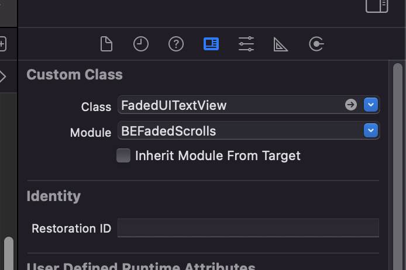
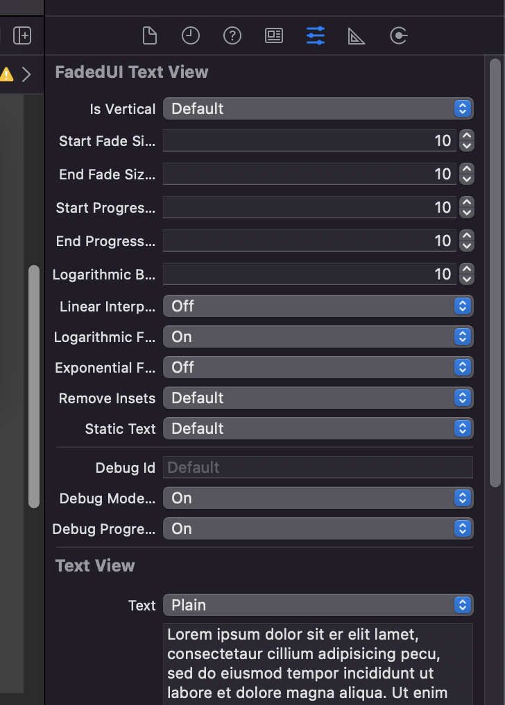
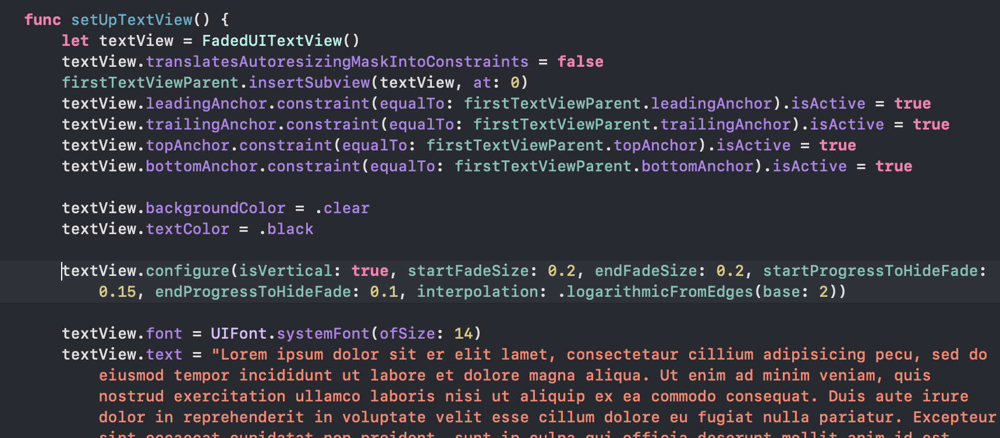
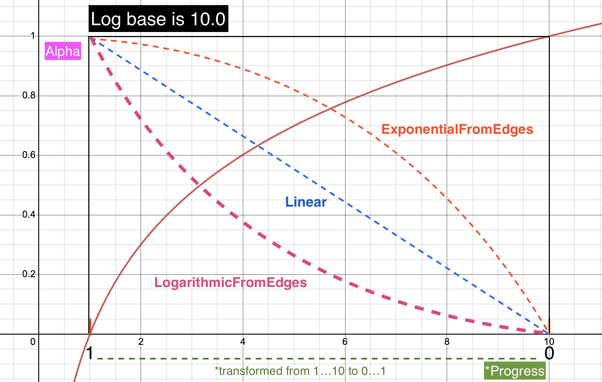

# BEFadedScrolls

- [Library main information](#Library-main-information)
- [Installation](#installation)
- [How to apply](#how-to-apply)
- [Configurable values](#Configurable-values)
- [Interpolation explained](#Interpolation-explained)
- [License](#license)

## Library main information

BEFadedScrolls is a light UIKit library that enables scrolls with faded edges. Faded edges are achieved via CAGradientLayer which is added onto UIScrollView subclass and applied as a mask. That mask's edge colors are being changed with overriden observable 'contentOffset' property.

<table class="tg">
<thead>
  <tr>
    <th class="tg-0pky">Demonstration</th>
    <th class="tg-0lax">Features and Demo description</th>
  </tr>
</thead>
<tbody>
  <tr>
    <td class="tg-0lax" rowspan="2"></td>
    <td class="tg-0lax"><h3>> Features</h3><ul><li><left>Quickly make scrollable content faded on edges</left></li><li>Works for UIScrollView, UITextView, UITableView, UICollectionView</li><li>Supports vertical ⇅ and horizontal scrolls ⇄</li><li>Configurable fades on both sides (top/bottom or left/right), enable/disable separately</li><li>Configurable interpolation (curve) (linear/logarithmic)</li><li>Supports IB and code setup</li></ol></td>
  </tr>
  <tr>
    <td class="tg-0lax"><h3>> Preview description</h3><ol><li>Example of FadedUITextView - a UITextView subclass with 2 faded edges</li><li>The FadedUITextView just like the first one but with <b><i>debug mode enabled</i></b> - shows how 'mask layer' alpha changes on scrolling</li><li>Example of horizontal fades with FadedUICollectionView</li></ul></td>
  </tr>
</tbody>
</table>
_______


## Installation
### CocoaPods

[CocoaPods](https://cocoapods.org) is a dependency manager for Cocoa projects. For usage and installation instructions, visit their website. To integrate Alamofire into your Xcode project using CocoaPods, specify it in your `Podfile`:

```ruby
pod 'BEFadedScrolls'
```

## How to apply

In IB simply set necessary class in the <b>Identity Inspector</b><br />
Configuration(setup) method is called automatically when FadedScroll element is created in IB<br />




<br />
In code use the one of 4 classes available or subclass them and create your view<br />
Then call one override of the 'configure' method and set the necessary values.<br />



<br />
You are responsible for setting position and size of Faded elements<br />

## Configurable values
Some of configurable values are:

### startFadeSize/endFadeSize
Is the size of fade (start/end) depending on scroll direction<br />
In IB (0...100) and (0...1) in code, the sizes of fades depedning on the size of FadedScrollView, if 0 the fade on the edge is disabled

### debugModeEnabled
enables some logs and doesn't apply CAGradientLayer as a mask but simply leaves it hanging on top so you can watch how gradient layer changes

### debugProgressLogs
enables progress logs so you can observe how interpolation and content offset change the alpha value

#### progress
in console is just simple progress how much of a content has been scrolled

#### startAbsProgress
in console is the untransformed alpha value of one's edge

#### startTransformedProgress
in console is the <b>modified</b> alpha value of one's edge depending on interpolation<br />
<br />
## Interpolation explained

### Internal 'progress' calculation

Each fade side (start/end) has (Double) progress calculated, when content offset is at the most near point to one edge, the progress is 1.0, and when content offset gets far enough from that edge the progress will be 0. (calculation depends on 'hideFadePercents')
You can consider 'progress' as a final alpha when 'LinearInterpolation' is enabled.

### hideFadePercents
Is the amount of how much user should scroll the content relatively to height of (UIScrollView) view in percents to fully fade out one of the edges<br />
In IB the value should be between (0...100) or 0...1 in code.<br />
For example, user scrolled the view for 20% of it's height, and 'hideFadePercents' is set to (20 in IB or 0.2 in code), 
the progress calculated will be 0(and so the alpha, content is fully faded out). If user scrolls to top alpha will start to increase until it reaches 1.0.<br />
<br />
The <b>Final alpha</b> depends on interpolation


### interpolation

Linear is simple linear dependence, LogarithmicFromEdges will make fading out steeper, and ExponentialFromEdges will make content fading out to accelerate exponentially.<br />
If 'linear'
interpolation is selected, the alpha of CAGradientLayer's top color will be equal to that progress. e.g.
when progress is 1.0 then the alpha will be 1.0 and therefore the top edge will be fully visible.<br />
'LogarithicFromEdges' will make logarithmic dependence which will accelerate fading out on the begginning
of scroll (when user scrolls from top edge to see the content on the bottom).<br />That can be useful when you need to fade out content pretty fast. 

### logarithmic base

The default value is 10 (y = log(10)X)<br />
The value is useful only for LogarithmicFromEdges or ExponentialFromEdges modes<br />
The value should be in the range of 2...10<br />
The smaller the value the faster the content will fade, although any value except 10.0 will make 'hideFadePercents' effectively smaller



## License

BEFadedScrolls is released under the MIT license. [See LICENSE](https://github.com/DevBorisElkin/BEFadedScrolls/blob/main/LICENSE) for details.
